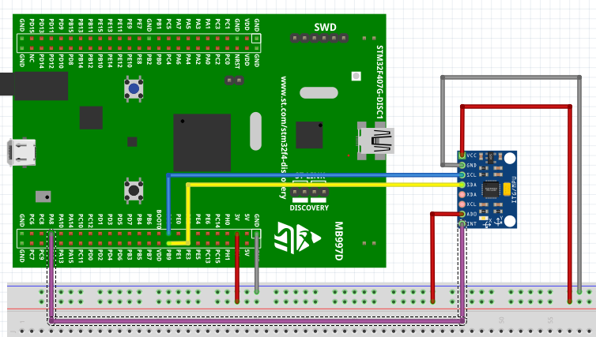

# STM32F4 MPU6050 Açı Tabanlı LED Kontrol Sistemi

Bu depo, bir **MPU6050** (İvmeölçer ve Jiroskop) sensörü ile **STM32F407G-DISC1** mikrodenetleyici kartının haberleştirildiği kapsamlı bir gömülü sistem projesini içermektedir. Sistem, sensörün x,y,z ivme değerlerini okur , bu veriyi bir **Kalman Filtresi** ile işleyerek y ve z arası eğim açısını bulur ve bu değere göre   kart üzerindeki 2 adet LED'in yanıp sönme süresini Darbe Genişlik Modülasyonu (PWM) kullanarak kontrol eder.

Gömülü yazılım mimarisindeki farklı yaklaşımları göstermek amacıyla, aynı sistem mantığı üç farklı yöntemle geliştirilmiştir:
1. **Bare-Metal** (Doğrudan Yazmaç/Register Erişimi)
2. **STM32 HAL Kütüphanesi**
3. **RTOS** (Gerçek Zamanlı İşletim Sistemi)

Özellikle bare-metal kullanımı mpu6050 bsp layer ve TIMER,GPIO,I2C,USART driverlarının tasarlanmış olması sebebiyle başka projelerede faydalı olacak bir kaynak olması amaçlanmıştır.

## 📸 Proje Demosu

## 🚀 Proje Mantığı ve Özellikler

* **Sensör Okuma ve Veri Birleştirme (Sensor Fusion):** MPU6050'den okunan ham ivmeölçer verileri I2C hattı üzerinden alınır.
* **Kalman Filtresi:** Ham sensör verilerindeki gürültü (noise) yazılımsal olarak temizlenir ve matematiksel kaymalar engellenerek kusursuz bir eğim açısı hesaplanır.
* **PWM Çıkışı:** Zamanlayıcı (Timer) kanalı çıkış (output) modu olarak yapılandırılır ve dalga formları üretmek için kullanılır. Kanal çıkış modunda yapılandırıldığı sürece, `TIMx_CCRy` yazmacının içeriği, timer sayacının (timer counter) içeriği ile karşılaştırılarak PWM sinyali oluşturulur[cite: 4].
* **1 Hz Yanıp Sönme (Blinking) Efekti:** Timer'ın bir periyodu bilinçli olarak 1 saniyeye (1 Hz) ayarlanmıştır. Bu nedenle hesaplanan Duty (Görev Döngüsü) değeri, LED'lerin parlaklığını pürüzsüzce kısmak yerine (dimming), onların **yanık kalma ve sönük kalma sürelerini (yanıp sönme hızı/süresi)** belirler. Eğim arttıkça LED'in 1 saniyelik periyot içindeki yanık kalma süresi uzar.

## 🛠️ Donanım Kurulumu ve Bağlantılar

* **Mikrodenetleyici:** STM32F407G-DISC1 Geliştirme Kartı
* **Sensör:** MPU6050 Modülü

### Pin Bağlantı Tablosu
*(Bağlantılarınızı kendi konfigürasyonunuza göre güncelleyebilirsiniz)*
| STM32F4 Pini | MPU6050 Pini | İşlev |
| :--- | :--- | :--- |
| **PB8** | SCL | I2C Saat (Clock) |
| **PB9** | SDA | I2C Veri (Data) |
| **3V3** | VCC | Güç Kaynağı (+3.3V) |
| **GND** | GND | Ortak Toprak |
| **PD12** | - | Kart Üzerindeki LED 1 (Timer 4, CH1) |
| **PD13** | - | Kart Üzerindeki LED 2 (Timer 4, CH2) |

## 📁 Yazılım Mimarileri (Klasör Yapısı)

Bu repoda yer alan üç farklı yaklaşım, donanım katmanıyla farklı şekillerde iletişim kurar:

### 1. Bare-Metal
Uygulama ve sürücü kaynak dosyalarının (Application and Driver source files) doğrudan cihaza özel başlık dosyalarını (device header) içerecek şekilde geliştirildiği mimaridir. Çevre birimlerinin bellek haritasındaki temel adresleri üzerinden, donanım yazmaçlarına (register) ST'nin dış kütüphaneleri olmadan doğrudan müdahale edilir. Sistem saati (Clock), GPIO alternatif fonksiyonları, I2C ve Timer ayarları en alt seviyede kurgulanmıştır.

### 2. HAL Library (Donanım Soyutlama Katmanı)
STM32 Cube Framework program akışına dayanan standart ST yaklaşımıdır. Uygulamanın en başında `HAL_Init()` fonksiyonu çalıştırılır, ardından `SystemClock_Config()` ile saat ayarları yapılandırılır[cite: 4]. Çevre birimi başlatma (Peripheral Initialization) işlemleri tamamen standart Driver API çağrıları kullanılarak güvenli ve hızlı bir şekilde gerçekleştirilir.

### 3. RTOS
Sistemin Gerçek Zamanlı İşletim Sistemi kullanılarak görevlere (Tasks) bölündüğü versiyondur. Sensör okuma, Kalman filtresi hesaplamaları ve PWM güncelleme işlemleri bağımsız görevler olarak eşzamanlı (concurrent) bir yapıda, ana döngüyü (while loop) meşgul etmeden işletilir.

## ⚙️ Kurulum ve Çalıştırma
