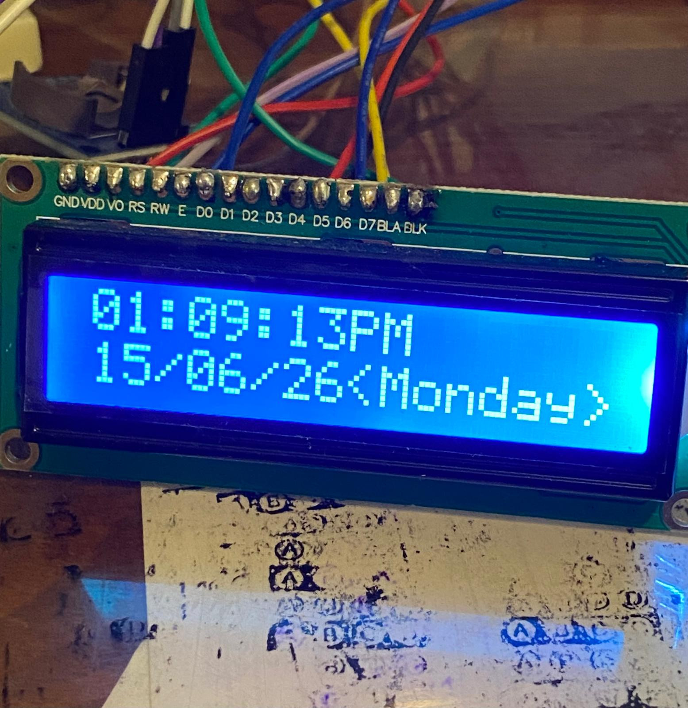
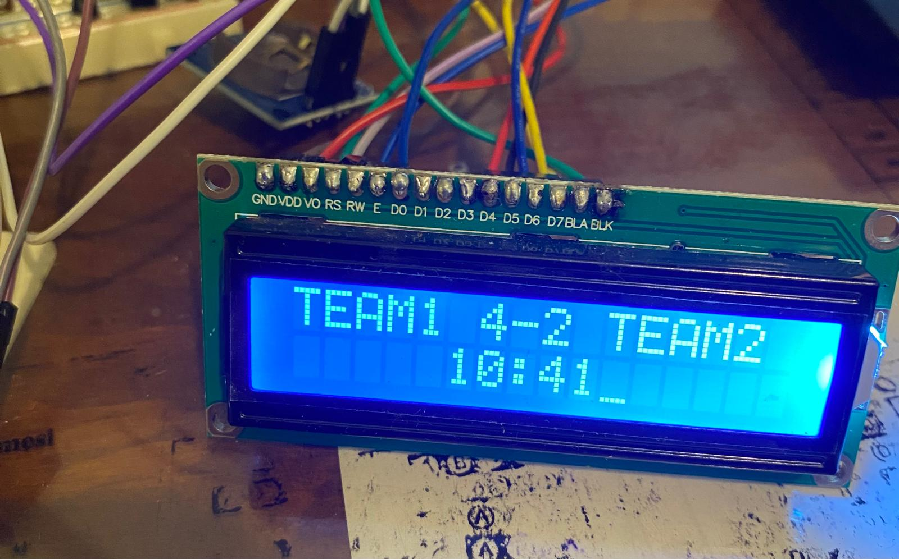
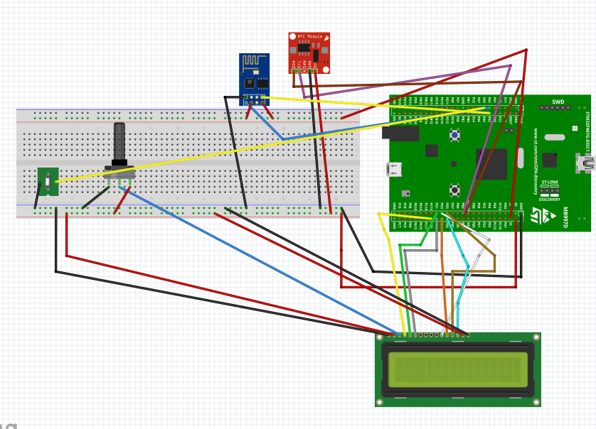

# 🏟️ STM32F4xx Bare-Metal Sürücü Geliştirme ve IoT Skor Tabela (Scoreboard) Projesi

Bu depo, **STM32F407 Discovery** mikrodenetleyicisi üzerinde, herhangi bir HAL veya hazır kütüphane kullanılmadan, tamamen register düzeyinde (**Bare-Metal**) geliştirilmiş çevresel birim sürücelerini (Drivers) ve bu sürücüler üzerine inşa edilmiş uçtan uca akıllı bir **IoT Skor Tabela (Scoreboard) Ekosistemini** içermektedir.

Sistem, saha içi fiziksel butonlardan kesme (Interrupt) tabanlı aldığı gol verilerini işler, **DS1307 RTC** üzerinden zaman damgası vurur, **ESP8266** üzerinden **FastAPI Backend sunucusuna** asenkron HTTP POST istekleri olarak uçurur ve eşzamanlı olarak yerel **16x2 LCD ekranı** günceller.

---

## 📸 Proje Görselleri ve Çalışma Mantığı

Sistem üzerindeki akıllı scoreboard, dinamik bir ekran yönetim motoruna sahiptir. Ekran yapısı, oyun akışını ve zaman takibini kolaylaştırmak adına iki farklı mod arasında otomatik geçiş yapar:

### 1. Saat ve Tarih Ekranı (NTP Senkronizasyonlu)
Sistem ilk açıldığında dünyadaki NTP sunucularına bağlanarak yerel RTC'yi günceller ve bu saat tarih bilgisini 1.ekranında gösterir.

### 2. Canlı Skor ve Geçen Süre Ekranı
Butonlardan gelen gol kesmeleriyle birlikte ekran anlık olarak takımların güncel skorunu ve maçın başladığı andan itibaren kronometre gibi akan süreyi canlı gösterir.

---

## 🏗️ Katmanlı Yazılım Mimarisi (Layered Architecture)

Proje, sürdürülebilirlik ve taşınabilirlik (portability) ilkelerine uygun olarak 3 ana katman halinde tasarlanmıştır:

<table>
  <thead>
    <tr>
      <th align="left">🧱 YAZILIM MİMARİSİ KATMANLARI</th>
    </tr>
  </thead>
  <tbody>
    <tr>
      <td>
        <b>🚀 Uygulama Katmanı (Application Layer)</b> 
        • Skor & Saat Yönetimi  
        • Kesme İşleyicileri (Interrupt Handlers)  
        • API Bilgi Alışverişi (FastAPI & ESP8266 Haberleşmesi)
      </td>
    </tr>
    <tr>
      <td>
        <b>🎛️ Kart Destek Paketi (BSP Layer)</b> 
        • DS1307 RTC Donanımsal Saat Sürücüsü  
        • 16x2 LCD Karakter Ekran Sürücüsü
      </td>
    </tr>
    <tr>
      <td>
        <b>⚙️ Yalın Metal Sürücü Katmanı (Low-Level Drivers)</b> 
        • GPIO, I2C, SPI, UART Register Düzeyinde Çevresel Birim Sürücüleri
      </td>
    </tr>
  </tbody>
</table>

### 1. Düşük Seviye Sürücü Katmanı (Low-Level Peripheral Drivers)
Mikrodenetleyicinin donanımsal register'ları doğrudan manipüle edilerek yazılmıştır:
* **GPIO Driver:** Mod seçimi (Input, Output, Alternate Function, Analog), Hız, Pull-Up/Pull-Down konfigürasyonları ve EXTI (Harici Kesme) yönetimi.
* **UART Driver:** Kesme (Interrupt-driven) tabanlı asenkron veri iletimi ve alımı (TX/RX FIFO mantığı), baudrate üreteci tasarımı.
* **I2C Driver:** Master modu yapılandırması, Start/Stop kondisyon üreticileri, veri/adres fazı yönetimi ve ACK/NACK kontrolleri.
* **SPI Driver:** Master/Slave tam çift yönlü (Full-Duplex) haberleşme mimarisi.

---

## 📌 Donanım Bağlantı Şeması ve Pin Mapping

### Fritzing Devre Şeması
Sistemin prototip aşamasındaki tüm kablolama mimarisi, bus hatları ve modül bağlantıları aşağıdaki Fritzing şemasında gösterilmiştir:

| Kaynak Bileşen | Kaynak Pin | STM32 İşlemci Pini / Fonksiyonu |
| :--- | :---  | :--- |
| **ESP8266 (Wi-Fi)** | RXD |  **PA2** | (USART2_TX) |
| **ESP8266 (Wi-Fi)** | TXD |  **PA3** |(USART2_RX) |
| **TEAM 1 Buton** | 1 (Sinyal) |  **PA5** | (EXTI9_5 Harici Gol Butonu) |
| **TEAM 2 Buton** | Dahili  | **PA0** (Kart Üzerindeki Mavi Dahili B1 Butonu) |
| **DS1307 RTC** | SCL  | **PB6** (I2C1_SCL Donanmsal Saat Hattı) |
| **DS1307 RTC** | SDA  | **PB7** (I2C1_SDA Donanımsal Veri Hattı) |
| **16x2 LCD Ekran** | RS  | **PD0** / Register Select Kontrol Hattı |
| **16x2 LCD Ekran** | E  | **PD2** / Enable (Aktifleştirme) Hattı |
| **16x2 LCD Ekran** | R/W  | **PD1** / Read-Write (Okuma-Yazma) Seçimi |
| **16x2 LCD Ekran** | D4  | **PD3** / Data Bus 4 |
| **16x2 LCD Ekran** | D5  | **PD4** / Data Bus 5 |
| **16x2 LCD Ekran** | D6  | **PD5** / Data Bus 6 |
| **16x2 LCD Ekran** | D7  | **PD6** / Data Bus 7 |
| **Potansiyometre (POT)**| S (Wiper) | *LCD V0'a Bağlı* / Kontrast Ayar Hattı (Direkt LCD 3. Pine) |

> ℹ️ **Güç Bağlantıları Notu:** Dökümdeki ortak ağ analizine göre; LCD VDD, LCD LED+, RTC 5V ve Potansiyometre E ucu STM32'nin **5V** hattından beslenmektedir. LCD VSS, LCD LED-, RTC GND, POT A ucu ve ESP8266 GND pinleri ise STM32 **GND** şasesi ile ortaklanmıştır.ESP8266'nın 3.3v ve EN pinleri harici kaynakta daha kararlı çalışsada STM32F407G-DISC1 üzeinden 3.3v ile de beslenebilir.

> ⚠️ **Önemli Donanım Notu:** ESP8266 modülü Wi-Fi paket iletimi esnasında yüksek akım (~200-300mA) çektiği için STM32 dahili regülatörü yerine harici kararlı bir **3.3V regülatör ** üzerinden beslenmelidir. Şaseler (GND) ortaklanmalıdır.

---

## 💻 HTTP POST İstek Paketi Yapısı

Donanımın gol anlarında ürettiği ve ESP8266 TCP soketinden FastAPI sunucusuna gönderilen ham HTTP paketi şu şekildedir:

<pre>
POST /api/records HTTP/1.1
Host: 192.168.1.24:8000
Content-Type: application/json
Content-Length: 78
Connection: close

{"pitch_id":1,"team_id":1,"datetime_from_st":"2026-06-13 18:55:42","user_id":1}
</pre>

---

## 🛠️ Kurulum ve Derleme Ayarları

1. **Gereksinimler:** Proje, **STM32CubeIDE** veya `arm-none-eabi-gcc` derleme araç takımı ile tam uyumludur.
2. **Derleme:**
   * Projeyi STM32CubeIDE içerisine aktarın (Import).
   * Kod içerisindeki `HOST` makrosunu FastAPI sunucunuzun yerel IP adresiyle güncelleyin:
<pre>
#define HOST "192.168.1.24" // Sunucu IP'niz
</pre>
   * **Build Configuration** ayarını `Release` moduna getirin ve derleyin.
3. **Flaşlama:** ST-LINK vasıtasıyla derlenen `.elf` veya `.bin` dosyasını target karta yükleyin.

---

## 🤝 İlgili Depolar (Eko-Sistem Parçaları)
Bu proje, aşağıdaki bağımsız sistemlerle birleşik (entegre) çalışmaktadır:
* 🌐 [MatchRecord FastAPI Backend Engine](https://github.com/EmreBilal98/matchrecord_fastapi.git) - Veri kayıt ve JWT doğrulama sunucusu.
